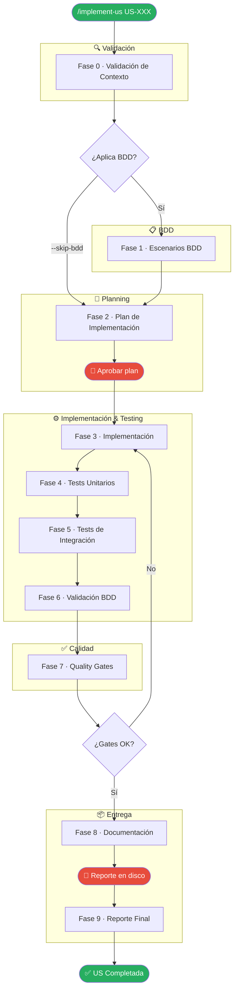
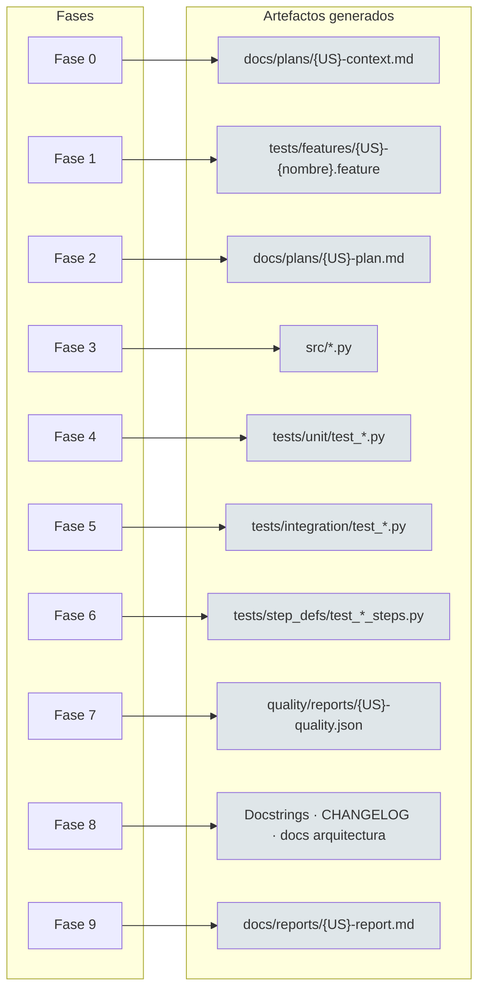

# Diagramas Visuales — implement-us

**Versión:** 2.1.0 (v1.3.0 del framework)
**Última actualización:** 2026-02-28

Referencia visual del skill `implement-us`. Incluye el flujo de ejecución de las 10 fases y el mapa de artefactos generados.

---

## Flujo de Ejecución

Muestra el pipeline completo: fases en orden estricto, puntos de aprobación (🛑), bifurcación skip-BDD y loop de recuperación en quality gates.

> Los nodos 🛑 son bloques sincrónicos: el agente no avanza hasta que el usuario da aprobación explícita (Fase 2) o hasta que el reporte existe en disco (Fase 9).

---

## Mapa de Artefactos

Muestra el artefacto principal generado por cada fase y su ruta canónica en disco.

> La ruta canónica completa de cada artefacto está definida en [`skills/implement-us/artifacts.md`](../../../../skills/implement-us/artifacts.md).

---

## Navegación

[← Índice del skill](index.md) · [Fase 0 →](phase-0.md)
